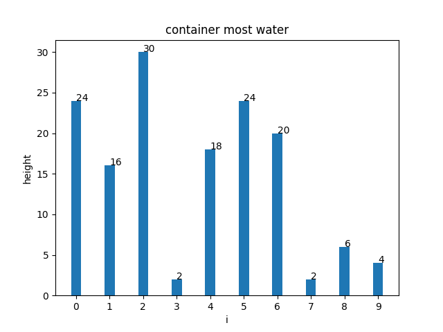

## Container With Most Water

### Problem
well you are given array of positive numbers [24, 16, 30, 2, 18, 24, 20, 2, 6, 4](heights) and each
element represent a height


and we should find two lines that together with x-axis from a container contains most water
and return the maximum amount of water a container can store for example


as you can see there's multiple options and we need to return the biggest one for example green box

### How??
well let's see brute force solution first well as first idea we could use two pointers put one at
the first line (0 index) and check every area from there in other words check (0, 1) (0, 2) (0, 3)
and so on and after that increment the fisrt (1 index) and repeate (1, 2) (1, 3) and so on a bit of
pictures could help here


and we countinue doing this until we get to this point


and we repeat but now starting from index 1


```cpp
int maxArea(vector<int>& height) {
    int i = 0;
    int currentMax = -1;

    while (i < height.size()) {
        int k = 1;
        int leftHeight = height[i];
        while (i + k < height.size()) {
            int rightHeight = height[i + k];
            int width = k;
            int smallestHeight = leftHeight < rightHeight ? leftHeight : rightHeight;
            int area = width * smallestHeight;
            if (area > currentMax) {
                currentMax = width * smallestHeight;
            }
            ++k;
        }
        ++i;
    }
    return currentMax;
}
```
### Can We Do Better
well what do we need to get a big area well either bit width or height or both of them so I would say
that we maximize the width first by putting two pointers one at the start one at the end like this

so the area now is 4 * 9
Now we ask well 24 is greater than 4 and 4 is the bottel neck here we could move the right pointer
to the left by 1 and possibly we gain more area yes you are going to loss 1 in width but you are
going to gain 2 in the height

and now the area is 8 * 6 = 48 which is better, and we repeat, but hold on we are going to move on
to smaller height so we loss width and height BAD, well no because yes are going to loss area here
but later we could gain a lot like losing 2 in the width but we are going to gain 16 (20 - 4) in height
which is better


well now the area is 6 * 20 = 120 which is the best. you may ask why this is working, well let me
modify this question by asking did we skip a combination here? if yes is that fine? you know what
let's filp the array to see why is that


as you can see that for this iteration (iteration 0) that the maximum height will be 4 so possibly
the biggest are is going to be 4 * width left in this case it's 8 so area 4 * 8 = 32 so
the calculuation for 4 * (1-0), 2 * (2-0) and so on not really needed, so that's why in this case
to move to the colum height of 6 and repeat, so yes not all combinations are tested but we do need
to test all combinations.

```cpp
    int maxArea(vector<int>& height) {
        int maxArea = 0;
        int leftIndex = 0;
        int rightIndex = height.size() - 1;
        
        while (leftIndex < rightIndex)
        {
            int currentHeight = height[leftIndex] < height[rightIndex] ? height[leftIndex] :
            height[rightIndex];
            int currentArea = currentHeight * (rightIndex - leftIndex);
            if (currentArea > maxArea) {
                maxArea = currentArea;
            }
            if (height[leftIndex] > height[rightIndex]){
                --rightIndex;
            } else {
                ++leftIndex;
            }
        }
        return maxArea;
    }
```