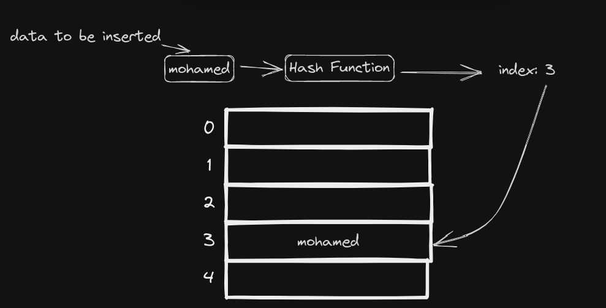
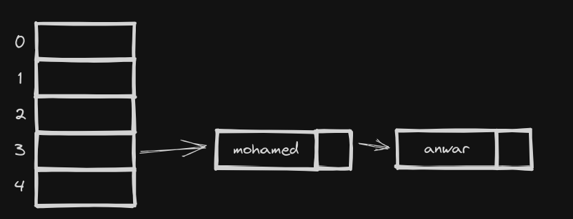
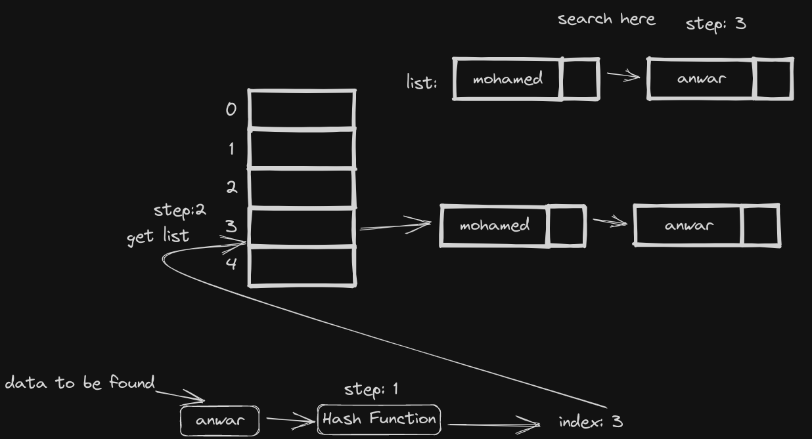
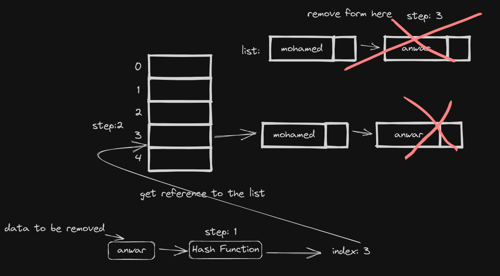

### Hash Map

### overview
well hash map is data structure that is best for query stuff
like store data in it to ask later is data 'X' in there pretty fast

### Can Do On average
* insert in O(1)
* search in O(1)
* delete in O(1)

### How
well we can use just array because array can do all this operations right?
yes it can do them but in O(1) for example search would take O(n) and it's
hard to insert and delete well linked list can do these insert/delete easy
yet it can but search is bad so? well can combine them to form this data
structure *hash map* the problem with search in array is that to say yes
what you are looking for exist or no you have to check the entire array.
well can we use the data itself to give us some how index well yeah
we could use hash function before we insert

**Insert:**
1. pass a value that you want to insert into [hash function](#hash-function) and you will get index
2. so you will go into array at the index returned by the hash function and insert it simply
3. 
you may see a problem well this is just static array yeah I can find values in it
easy but I can not add more than I initially allocated for the array well, and what
if the function returns for different values the same index aka *collision*

well instead of using array data can store data why don't we store list that
can hold our data

well now all problems solved I can increase the size since lists are easy to extended
and if *collision* I can just add it to the list for example *mohamed* and *anwar* gave index 1 I could just add the latter one to the list in index 1

**Search:**
1. get the index by running hash function on the data
2. with that index you get list stored in there
3. search in the list of the data exist

**Delete:**
1. get the index by running hash function on the data
2. with that index you get reference to the list stored in there
3. find it remote it

#### Hash Function
well this function take the data and it will give you index
well it's hard to make good hash function and what make hash function good?
well it should use the entire input and only the input no random or time
related stuff and it should be distrubuted in other words it should always
return the same index for example 1