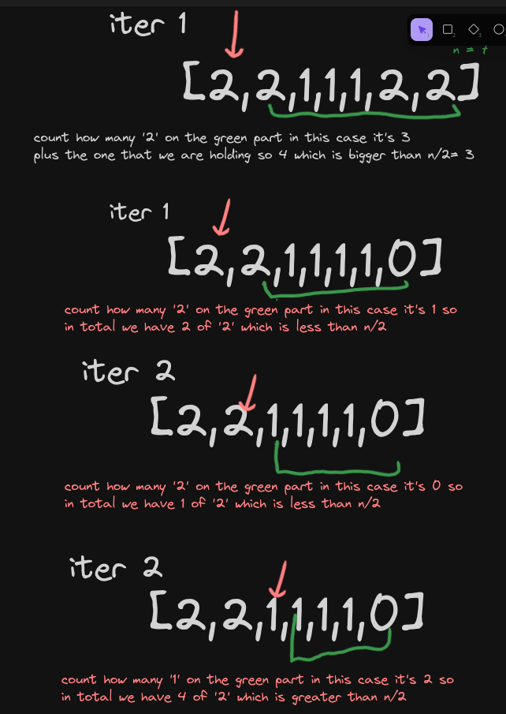

#### Problem
```
Given an array nums of size n, return the majority element.

The majority element is the element that appears more than ⌊n / 2⌋ times. You may assume that the majority element always exists in the array.
```

```
I would take every element count how many accournce
if it's bigger than n/2 that would be the right element
```

