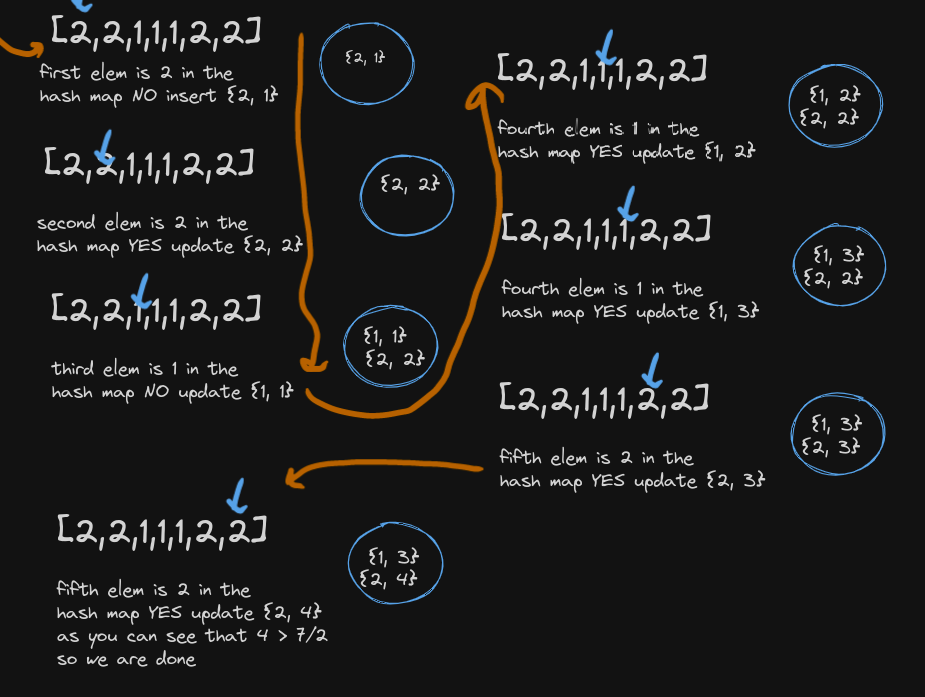

#### Problem
```
Given an array nums of size n, return the majority element.

The majority element is the element that appears more than ⌊n / 2⌋ times. You may assume that the majority element always exists in the array.
```

```
what I would do is to create
hash map and hash map I can
check if object is there in constant
time so I will loop over the array
and if the element does not exist
I will insert {elm, 1}, and if not
I will update the existing one with
{elm, old_elm_value + 1}
```

