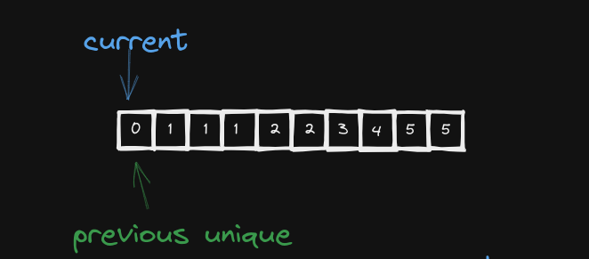
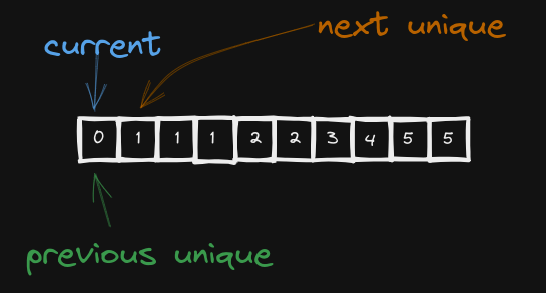
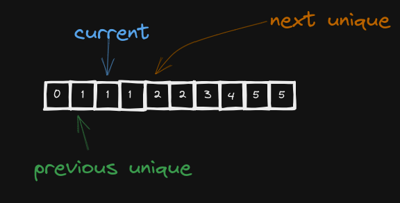
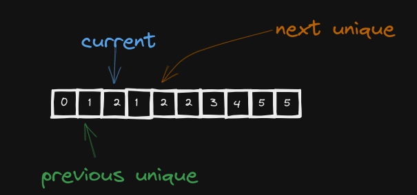
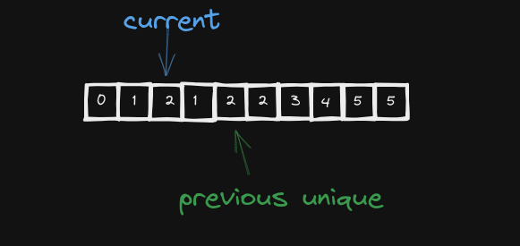

## remove duplicates from sorted array


## First Idea
>the first idea is to look at the previous
>and ask is this element unique and if the
>answer is yes move on to the next element
>and if not find "THE NEXT UNIQUE ONE"
>well what should we do now? well easy find the [next unique element](#next-unique-element)
>and we keep doing this until we can not find any next unique element then we can return
>the current index


### Current Element Unique!!!
>well how would I find out if the previous element is unique well easy search for the current element
>in sub array 0-to_current_index

```python
def isCurrentElementUnique(current_index, arr):
    current_element = arr[current_index]
    for i in range(0, current_index):
        if arr[i] == current_element:
            return False
    return True
```

<a name="nue"></a>
### Next Unique Element
>to the next unique element is easy this is a bit tricky well for every element in sub array [current_index + 1, last_element]
>is it in sub array [0, current_index]

```python
def getNextUniqueElement(current_index, arr):
    start = current_index + 1
    end = len(arr)
    for i in range(start, end):
        if isCurrentElementUnique(i, arr):
            return (True, arr[i])
    return (False, -1)
```

### First Solution source code
```py
class Solution(object):
    def removeDuplicates(self, nums):
        """
        :type nums: List[int]
        :rtype: int
        """
        arr_len = len(nums)
        i = 0
        while i < arr_len:
            if not self.isCurrentElementUnique(i, nums):
                found, value = self.getNextUniqueElement(i, nums)
                if found:
                    nums[i] = value
                else:
                    return i
            i += 1
        return i

    def getNextUniqueElement(self,current_index, arr):
        start = current_index + 1
        end = len(arr)
        for i in range(start, end):
            if self.isCurrentElementUnique(i, arr):
                return (True, arr[i])
        
        return (False, -1)

    def isCurrentElementUnique(self, current_index, arr):
        current_element = arr[current_index]
        for i in range(0, current_index):
            if arr[i] == current_element:
                return False
        return True
```

well this solution gives timeout at leetcode so I will just try C++ without optimizing for now
and here's github link for all details
but as you can see it's pretty bad

### Is This The Best We Can Do?
>well the idea is that we start with two pointers like this
and now we will search for the next element but how? well since the array is sorted
the next element is the element that is greater than the element at `previous pointer`
why not `current pointer` it will be clear later do not worry
well now we move `current pointer` to the next, we copy the value at `next unique` to it
(current pointer), and we move on `previous pointer` to be the same as the `next pointer`
and repeat
#### Next Iteration
move current
copy value fro `next unique` to `current pointer`
move `previous pointer`
and we repeat until there's no `next unique`


