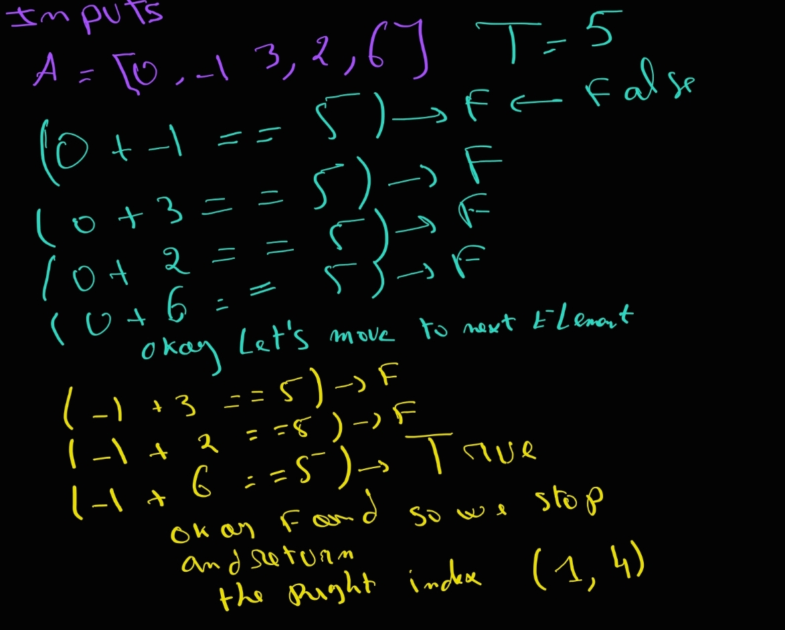
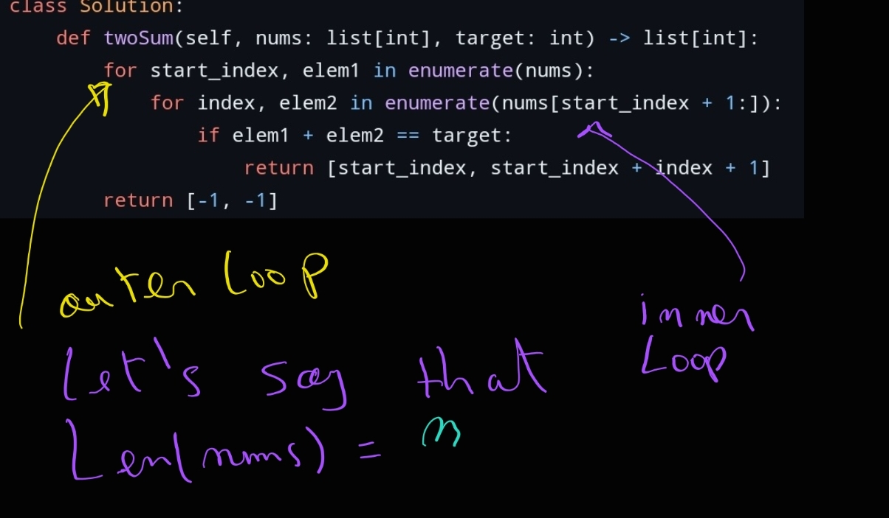
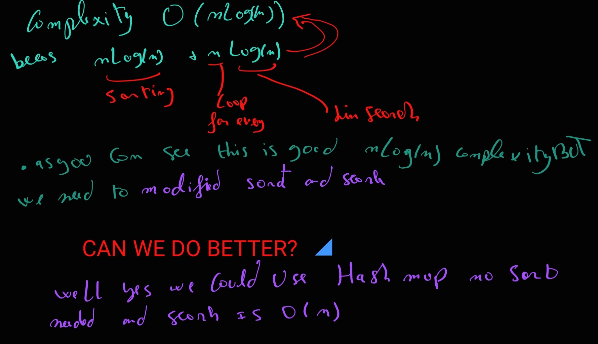
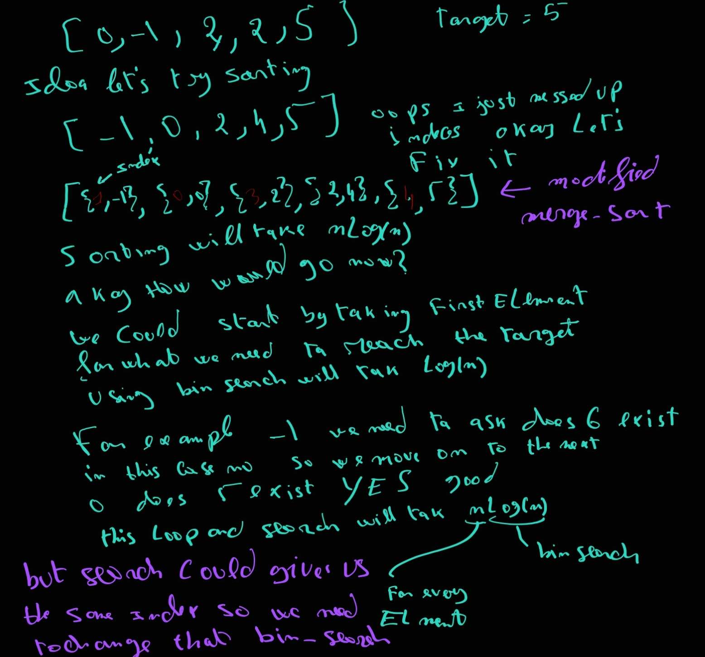
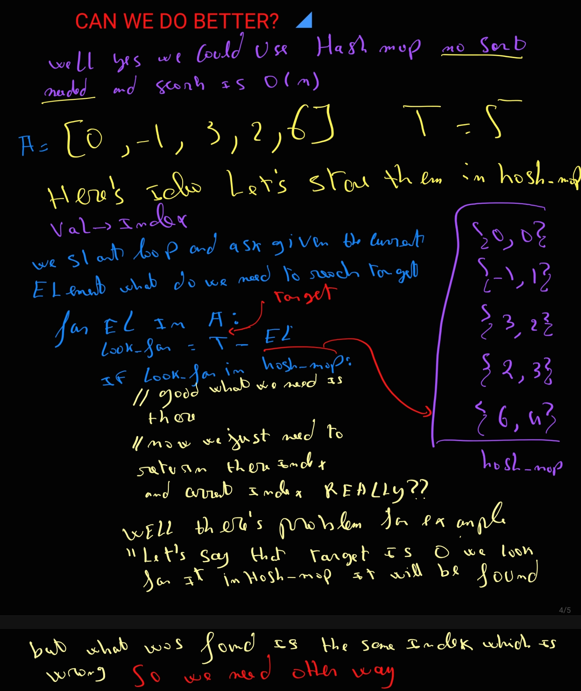
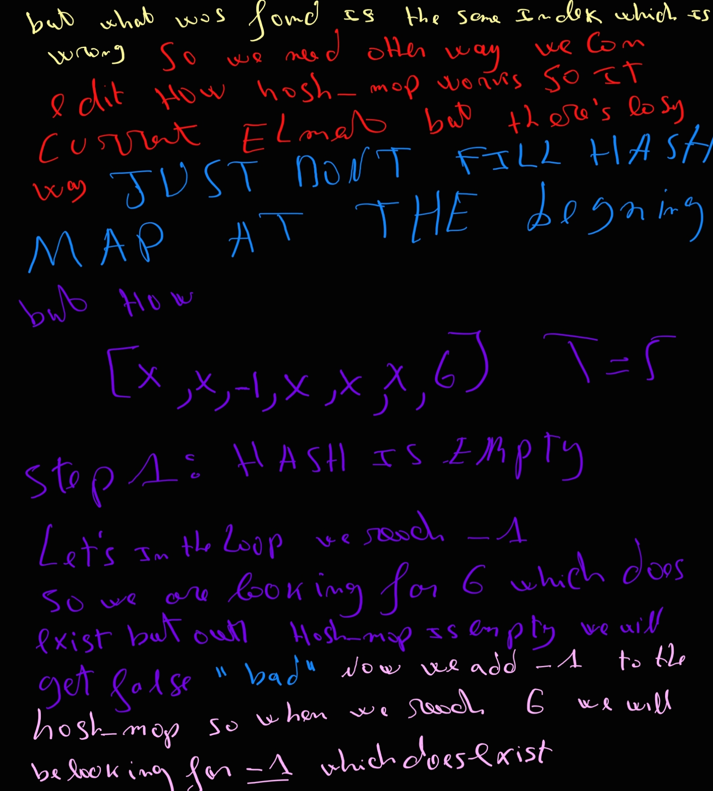

#### Problem Explaind
```
you are given a list of numbers and we will try
to find two numbers that when you add them you get 
a target value and we return thier indeces
```

###### Example
```
*L = [0, -1, 3, 2, 6]*
*T = 5*
```

##### Solutions
- **Brute Force**
```
idea is to try pick every element and try it with every
other element
```


##### Time complexity



````
first iteration of outer loop
inner loop will run for (n - 1)

second iteration of outer loop
inner loop will run for (n - 2)

third iteration of outer loop
inner loop will run for (n - 3)

nth iteration of outer loop
inner loop will run for (n - nth)
WE WILL BE DONE AT THIS POINT
we need just to add them now

(n - 1) + (n - 2) + (n - 3) + ... 3 + 2 + 1
which is the as
1 + 2 + 3 + 4 + ... + (n - 1)

let's just add 1 element to the array just to make match
the sum series
1 + 2 + 3 + 4 + .... + n = n(n + 1)/2

so complexity is O(n^2)

CAN WE DO BETTER ??
````

````
YES
we can for example sort the array at nlog(n)
and the for every element we search for what we need
to reach the target
for example
A = [X, X, X -1, X, X, 6] Target = 5

so we -1 is reached we need 6 to get to 5
so we will search for the 6 in sorted array
search will cost us log(n) using binary search
but it's bit problematic since we could get same index
so the sorted array will need to hold objects that have the index
and binary search should be modified to take current index as parameter
to ignore it.

IS THERE ESIER WAY? YES

we could use hash-map on averge search will cost us onlye O(1)
````




