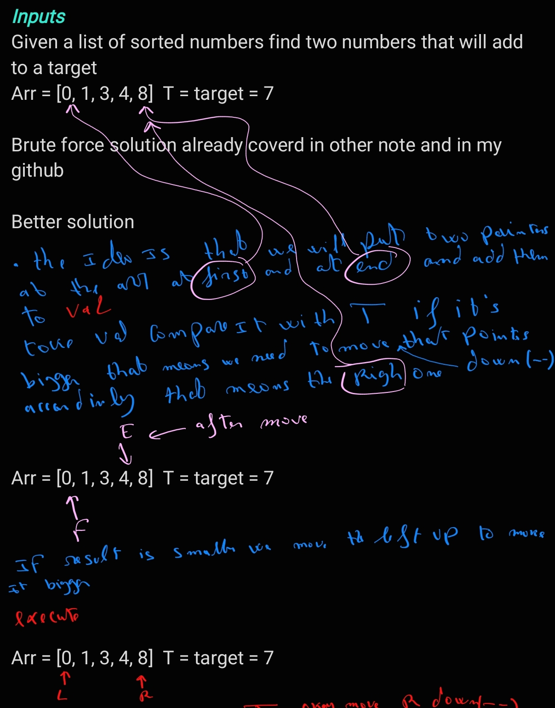
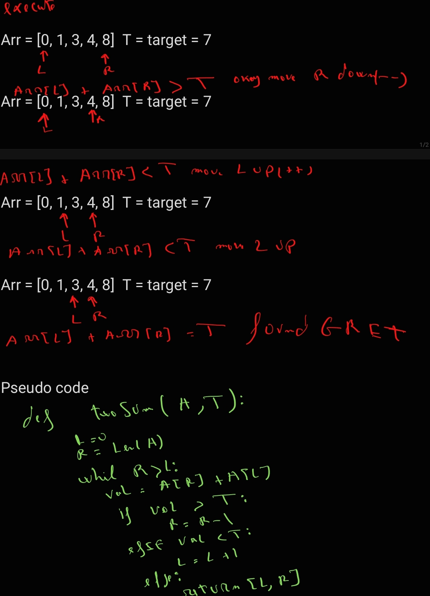

#### Two Sum II array is sorted

###### *Description*

```
Given a 1-indexed array of integers numbers that is already sorted in non-decreasing order, find two numbers such that they add up to a specific target number. Let these two numbers be numbers[index1] and numbers[index2] 

Return the indices of the two numbers, index1 and index2, added by one as an integer array [index1, index2] of length 2.
```


