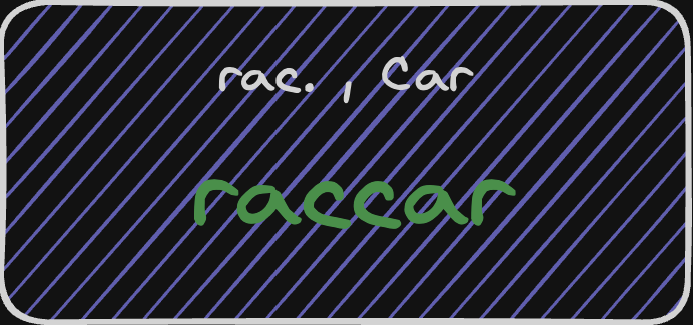
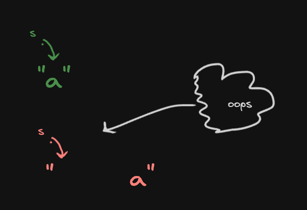
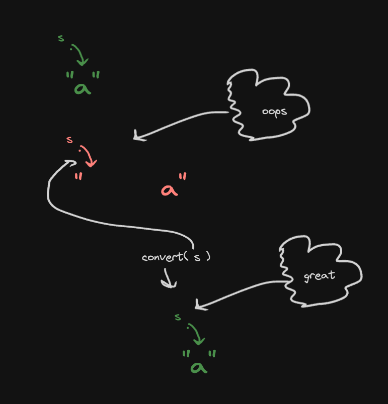
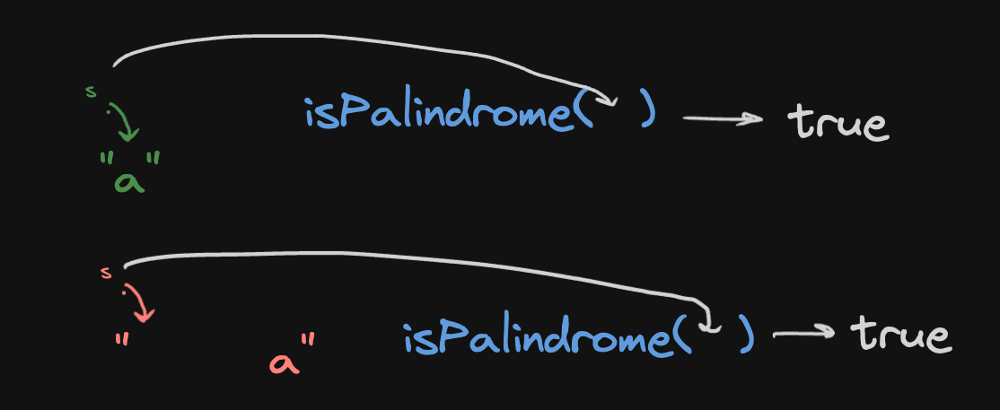
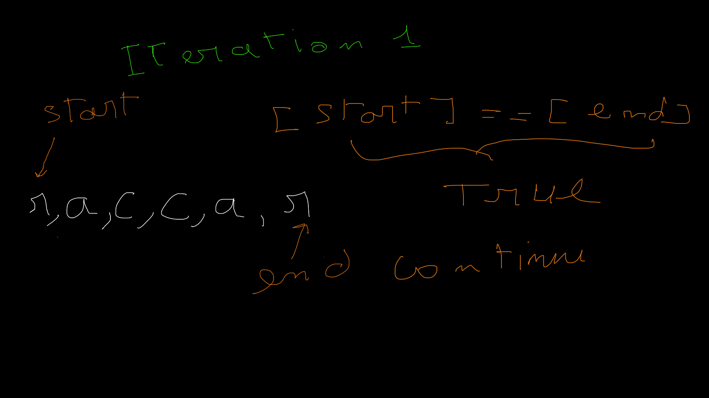

## valid palindrome



### Problem Explained
what do we mean by palindrome well a phrase is palindrome if after *coverting* all upercase letters
into lowercase letters and removing all non-alphanumeric characters it reads the same forward and
backword, for example `rac, Car` after *coverting* we will get `raccar` which is valid palindrome

### Solution
##### I
let's first ask some questions what if the input is empty that's by default a palindrome and what
about 1 character like `a` well that's also a planidrome so it first we could a put condition that
if the length is less than 2 that's automaticly true

```c++
bool isPalindrome(std::string s) {
    const auto slen = s.size();
    if (slen < 2) {
        return true;
    }
}
```
well the second one will pass this if so what should we do is to *convert* then run the condition
so how would we *convert* easy let's just remove non-alphanumeric charactes and I will also make
uppercase characters lowercase for now we will need them later.

```c++
std::string    convert(const std::string& s) {
    std::string tmp;
    for (auto c : s) {
        if (isalnum(c))
            tmp += std::tolower(c);
    }
    return tmp;
}
```
so now it will be like this
```c++
bool isPalindrome(std::string s) {
    s = convert(s);
    const auto slen = s.size();
    if (slen < 2) {
        return true;
    }
}
```
with this configuration both of them should return true

#### II
now let's see the general case well what we can do is to put two pointers one at the first and one at
the end, and the first pointer will move forward by 1, and end pointer will move backward by 1 and we
check if the vlaues that they are pointing the same we continue until start >= end, if not that means
the string is not palindrome

```c++
bool isPalindrome(std::string s) {
    s = convert(s);
    const auto slen = s.size();
    if (slen < 2) {
        return true;
    }
    int leftPointer = 0;
    int rightPointer = slen - 1;

    while (leftPointer < rightPointer) {
        if (s[leftPointer] == s[rightPointer]) {
            ++leftPointer;
            --rightPointer;
        } else {
            return false;
        }
    }
    return true;
}
```
